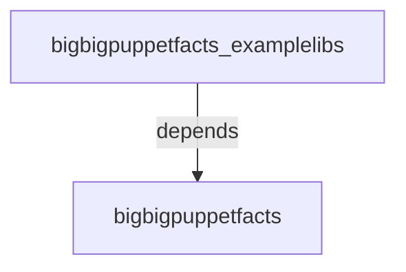

# bigbigpuppetfacts_examplelibs

Provide an addon/extension to the bigbigpuppetfacts engine, which eases the processing, encoding and compressing of facts. It comes
with functions to compress and encoding facts, which are long-running/expensive and
yet too big to store in puppetdb.

This also served as an example of add addons to the engine: provide additional methods
to the engine.


#### Table of Contents

- [bigbigpuppetfacts_examplelibs](#bigbigpuppetfacts_examplelibs)
      - [Table of Contents](#table-of-contents)
  - [Description](#description)
  - [Usage](#usage)
    - [Regular Facts (Inherited from bigbigpuppetfacts)](#regular-facts-inherited-from-bigbigpuppetfacts)
    - [Aggregate Facts (Inherited from bigbigpuppetfacts)](#aggregate-facts-inherited-from-bigbigpuppetfacts)
    - [Puppet Functions, used in Puppet Manifest  (Inherited from bigbigpuppetfacts)](#puppet-functions-used-in-puppet-manifest--inherited-from-bigbigpuppetfacts)
  - [Reference](#reference)
    - [`use_compressmethod_fallback(:fallback_method)` *Optional*](#use_compressmethod_fallbackfallback_method-optional)
    - [`use_compressmethod(:method)`](#use_compressmethodmethod)
    - [`compress(:data)`](#compressdata)
    - [`decompress(:data)`](#decompressdata)
  - [Puppet Functions](#puppet-functions)
    - [`bbpf_fn(data, use_runmethod, use_runmethodtype, bigbigpuppetfacts)` (Inherited from bigbigpuppetfacts)](#bbpf_fndata-use_runmethod-use_runmethodtype-bigbigpuppetfacts-inherited-from-bigbigpuppetfacts)
  - [Compress/Process Methods (Inherited from bigbigpuppetfacts)](#compressprocess-methods-inherited-from-bigbigpuppetfacts)
  - [Development](#development)
    - [Drivers](#drivers)

## Description

This demostrates how to add new modules:those named bigbigpuppetfacts_*

This involves writing ruby codes in lib/puppet_x/bigbigfacts/drivers. These are very simple ruby codes, which are very intuitive even for laymen and non-ruby programmers.


* Methods needs extra ruby gems/libraries, usually as another dependent puppet modules
  * xz - Packaged along with its needed gems and library.
  * bz2 & a few variants - Packaged along with its needed gems and libraries.
  * 7z - No GEMs Packaged here, using CLI/shellout interface only.


Here is a family tree of dependency modules, from the point of view of this module.
_**Note for developers of the new dependent modules, feel free to update this tree._



## Usage

[ See bigbigpuppetfacts for more details]( https://github.com/sooyean-hoo/bigbigpuppetfacts_/blob/4publicversion/README.md#usage )
<details>
<summary>Click to see Usage </summary>

### Regular Facts (Inherited from bigbigpuppetfacts)

```ruby
require 'facter/util/bigbigpuppetfacts'

Facter.add(:verybigfact) do
  use_compressmethod_fallback 'plain'
  use_compressmethod 'xz_base64'

  setcode do
    compress('This is an expensive value')
  end
end

## This tries to work on the String 'This is an expensive value'. It compresses the
## data using 'xz' method, then followed up with 'base64'. The result of this operation
## is then set as the value of the fact with the name 'verybigfact'.
##
## In the event of failure during the pre-check when the 'use_compressmethod' is called
## to set the desired compress method, the fallback method, plain, will be used instead.
##
##


```

### Aggregate Facts (Inherited from bigbigpuppetfacts)

```ruby
require 'facter/util/bigbigpuppetfacts'

Facter.add(:aggregate_verybigfact, :type => :aggregate) do
  use_compressmethod_fallback 'plain'
  use_compressmethod 'xz_base64'

  chunk(:ex1) do
    interfaces = {}
    interfaces[:ex1]=compress('This is an expensive value,1 compressed by xz, then
    encoded by base64')
    interfaces
  end

  chunk(:ex2) do
    interfaces = {}
    interfaces[:ex2]=compress('This is an expensive value2, compressed by xz, then
    encoded by base64 ')
    interfaces
  end

  use_compressmethod 'plain'

  chunk(:ex1_plain) do
    interfaces = {}
    interfaces[:ex1_plain]=compress('This is an expensive value2, uncompressed and
    in plain')
    interfaces
  end

end


```
### Puppet Functions, used in Puppet Manifest  (Inherited from bigbigpuppetfacts)

   - As part of the Puppet Manifest:
   ```bash
      bbpf_fn('aaaaaa', 'base64') => 'YWFhYWFh'
      bbpf_fn('aaaaaa', 'base64') => 'aaaaaa'
      'aaaaaa'.bbpf_fn('base64') => 'YWFhYWFh'
      '0000'.bbpf_fn('base64').bbpf_fn('base64','reverse') => '0000' # This encodes, then decodes by base644
      '0000'.bbpf_fn('xz_base64') => 'LJzBH7bzfQEAAAAABFla'
      '0000'.bbpf_fn('xz_base64').bbpf_fn('xz_base64','reverse') => '0000'
      'bbbb'.bbpf_fn('plain')  => 'bbbb'
  ```
  - At bash prompt:
  ```bash
      sudo -E /opt/puppetlabs/bin/puppet apply -e "notice( 'aaaaaa'.bbpf_fn('base64'))"  --modulepath=`sudo /opt/puppetlabs/bin/puppet config print vardir`/../
      sudo -E /opt/puppetlabs/bin/puppet apply -e "notice( 'aaaaa'.bbpf_fn('base64').bbpf_fn('base64','reverse'))"  --modulepath=`sudo /opt/puppetlabs/bin/puppet config print vardir`/../
      sudo -E /opt/puppetlabs/bin/puppet apply -e "notice( bbpf_fn('aaaaaa', 'base64'))"  --modulepath=`sudo /opt/puppetlabs/bin/puppet config print vardir`/../
      sudo -E /opt/puppetlabs/bin/puppet apply -e "notify{ bbpf_fn('aaaaaa', 'base64'):}"  --modulepath=`sudo /opt/puppetlabs/bin/puppet config print vardir`/../
  ```
</details>


## Reference

[ See bigbigpuppetfacts for more details](https://github.com/sooyean-hoo/bigbigpuppetfacts_/blob/4publicversion/README.md#reference)
<details>
<summary>Click to see Reference  </summary>

This module adds the following method which is accessible if you are creating custom facts. Note that each fact should contain:

```ruby
require 'facter/util/bigbigpuppetfacts'
```

To ensure that the methods are available when running Facter.

### `use_compressmethod_fallback(:fallback_method)` *Optional*

When the 'use_compressmethod' is called, it superceded the method/method-chain to be used as the fallback method/method-chain when the desired method/method-chain's pre-check failed

### `use_compressmethod(:method)`

Set the desired compress method and run a pre-check on the method to determine its validity.

### `compress(:data)`

data to compress/encode/process

### `decompress(:data)`

data to decompress/decode/deprocess

## Puppet Functions

### `bbpf_fn(data, use_runmethod, use_runmethodtype, bigbigpuppetfacts)`

This exposes the compress/processing/encoding method as Puppet Custom Functions. The compress/processing/encoding methods can be implemented by ruby codes, shell scripts or loaded from addon modules.

`data`: data to be compress/encode/process-ed

`use_runmethod`: Name of the method/method-chain to use for the processing/encoding. Any of the following methods/method-chains:
  - `plain`
  - `base64`
  - `gz`
  - method-chain e.g. `gz_base64`
  - more methods can be added via other bigbigpuppetfacts_* modules

`use_runmethodtype` *Optional* : There are 2 directions for the methods/method-chains: forward or backward. Any of the following units:

  - `run` - forward
  - `reverse` - backward
  - `compress` - forward
  - `decompress` - backward
  - `encode` - forward
  - `decode` - backward

`info` *Optional* : Extra Data Hash which can be used to provide additional settings to the method/method-chain.

</details>

## Compress/Process Methods (Inherited from bigbigpuppetfacts)

| Compress Methods Names | Description and Comments | Provided By Module(s) | Puppet function Example | Ruby Example (in Custom Facts ), before calling `compress('data_to_compress')` or `decompress('data_to_compress')` |
| :--------------------- | :--: | :-------------------: | :---------------------: | :--------------------------------------------: |
| xz |  xz compression, need additional gems to run, so it has be included in the module  | bigbigpuppetfacts_examplelibs | `bbpf_fn('data_to_compress','xz')` |  `use_compressmethod 'xz' ` |
| bz2 |  bzip2 compression, need additional gems to run, so it has be included in the module  | bigbigpuppetfacts_examplelibs | `bbpf_fn('data_to_compress','bz2)` |  `use_compressmethod 'bz2' ` |
| 7z |  7zip compression, need additional gems to run, so it has be included in the module  | bigbigpuppetfacts_examplelibs | `bbpf_fn('data_to_compress','bz2)` |  `use_compressmethod 'bz2' ` |
| xz_base64 |  compressed the data with xz, then a base64 encoding | bigbigpuppetfacts & bigbigpuppetfacts_examplelibs | `bbpf_fn('data_to_compress','xz_base64')` |  `use_compressmethod 'xz_base64' ` |


## Development

There is no test for the main component for this module yet to just fork and raise a PR.
There is however a test for the supporting custom fact: `bbpf_supportmatrix`.

Debugging can be triggered via the above test as a spec test.

Alternatively, there are additional test: a simple ruby script: [examples/tests/testbigbigpuppetfacts.rb](examples/tests/testbigbigpuppetfacts.rb). This can be used as an entry to the debugging effort.

Dependent Modules (bigbigpuppetfacts_*) which are developed based on this module
- bigbigpuppetfacts_examplelibs
- bigbigpuppetfacts_command
- bigbigpuppetfacts_qrcode

Hooks are placed in this module to load other methods (from the dependent modules) into this framework, so that it can be called via __Puppet Functions__ and integrate with Facter, so it can be used easily using the above mentioned supporting APIs: use_compressmethod, use_compressmethod_falback, compress and decompress. It is also checked and verified to able to run by the __Supporting Custom Fact__ `bbpf_supportmatrix` .

### Drivers
As mentioned above, ruby codes, which are in lib/puppet_x/bigbigfacts/drivers, are the only things which this module contribute to to the bigbigpuppetfacts framework. They are also the only code which developers need to work on to extend the methods/functions of the framework.
These codes are the driver for that method. So each driver will be 1 ruby file under the folder lib/puppet_x/bigbigfacts/drivers. One ruby file, aka 1 driver can specified multiple process/compress/encoding method.
These will be illustrate via examples.

There are 2 types of supported methods: symmetric methods/functions and asymmetric methods/functions.

- symmetric methods/functions
  There are functions has an inverse. Hence if the function is denoted as f(x) and its inverse is i(x), then x = i((f(x)). Alternatively, if this is expressed in Linux commands with pipes,
  `echo "XXXXX" | f | i ` will print out XXXXX. Both the function and its inverse can be expressed in ruby code or other support form. They are to specified by the driver

- asymmetric methods/functions
	These are the functions without an inverse.

#### Asymmetric methods/functions
For this current module, we will be dealing with symmetric methods/functions which has the functions and its inverse counterpart here.
There are 3 examples here for each of the possible scenario:

- xz.rb
  This is the simplest form of the driver. This is a ruby implementation of the method. The shown by the xz::simple.

  - Driver name
  > The driver name is 'BBPFDrivers::XZ'. The driver loads mainly only 1 method: xz. This is abstracted by xz to use the underlying xz::simple.

  - Compressmethods/decompressmethods
  >The method is loaded as a proc under the ruby method `compressmethods`, while its inverse in loaded under the ruby method `decompressmethods`.

  - Test_methods
  > Since this is a symmetric method, the testing will be a simple form of `x == i(f(x)) ` . Although the test method is specified in the ruby method `test_methods`, it is redundent. The default test is `x == i(f(x)) `. We usually overwrite the test here for the asymmetric methods.

  - Autoload_declare
  > xz method need some addition gems to work, so here we get ruby to load these extra gem or libraries. However we do not just load the library, just in case this method is never used at all. So we set ruby to load it only if the Compressmethods/decompressmethods is ever called once. Please note that the `bbpf_supportmatrix` does call every method once. If you want finer control of the library loading, it would be best if you exclude your new method from autotesting in `bbpf_supportmatrix` custom fact. This done by addin the name of the method into a array.

  > As you may notice this a way to include addition gems and libraries to the puppet agent run without updating or change the default puppet's gempath. The ways to update the gems are documented [here](README_update.md). This is a cleaner way to package gem/libraries into the puppet agent run, as in the event that this module is removed from the node's environment, there will be not residual gems/libraries contamination the puppet agent's ruby gempath.


- bzip2.rb

- 7z.rb
