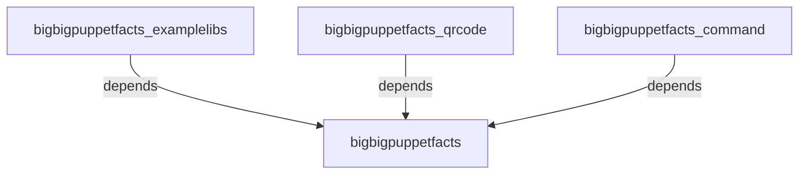

# bigbigpuppetfacts

Provide engine to ease the processing, encoding and compressing of facts. It comes
with functions to compress and encoding facts, which are long-running/expensive and
yet too big to store in puppetdb.


#### Table of Contents

- [bigbigpuppetfacts](#bigbigpuppetfacts)
      - [Table of Contents](#table-of-contents)
  - [Description](#description)
  - [Usage](#usage)
    - [Regular Facts](#regular-facts)
    - [Aggregate Facts](#aggregate-facts)
    - [Puppet Functions, used in Puppet Manifest](#puppet-functions-used-in-puppet-manifest)
  - [Reference](#reference)
    - [`use_compressmethod_fallback(:fallback_method)` *Optional*](#use_compressmethod_fallbackfallback_method-optional)
    - [`use_compressmethod(:method)`](#use_compressmethodmethod)
    - [`compress(:data)`](#compressdata)
  - [Puppet Functions](#puppet-functions)
    - [`bbpf_fn(data, use_runmethod, use_runmethodtype, bigbigpuppetfacts)`](#bbpf_fndata-use_runmethod-use_runmethodtype-bigbigpuppetfacts)
  - [Compress/Process Methods](#compressprocess-methods)
    - [Supporting Custom Facts](#supporting-custom-facts)
  - [Development](#development)

## Description

This creates a framework for add-on processing of facts. There are various processings
can be extended by add new modules namely module named bigbigpuppetfacts_*

This started as a framework to allow for puppet facts to compress into base64 encoding: there is
compression before the encoding. This is to address the concerns of having huge facts
of size > 30MB. This function is still part of the module. It is broken unto 2 parts:

* Methods using the puppet built-in ruby gems/libraries and included by this module.
  * gz: gzip
  * base64: base64 encoding
  * ^json: json encoding
  * ^yaml: yaml encoding
  * plain: There is no encoding, just a passthrough.
  * bbpf: Internal encoding, where the compression method is encoded as part of the encoding.
  * dataurl: Internal encoding, leveraging on other encoding/compression (esp base64) to have a
result which you put as a data-url.
  * bash: Internal encoding, leveraging on other encoding/compression (esp base64) to have self-extracting
bash script.

* Methods needs extra ruby gems/libraries, usually as another dependent puppet modules
  * xz - Packagedin bigbigpuppetfacts_examplelibs module
  * bz2 - Packaged in bigbigpuppetfacts_examplelibs module
  * 7z - Packaged in bigbigpuppetfacts_examplelibs module
  * qr - Packaged in bigbigpuppetfacts_qrcode module
  * cowsay - Packaged in bigbigpuppetfacts_command module

Here is a family tree of dependency modules.
_**Note for developers of the new dependent modules, feel free to update this tree._



## Usage

### Regular Facts

```ruby
require 'facter/util/bigbigpuppetfacts'

Facter.add(:verybigfact) do
  use_compressmethod_fallback 'plain'
  use_compressmethod 'xz_base64'

  setcode do
    compress('This is an expensive value')
  end
end

## This tries to work on the String 'This is an expensive value'. It compresses the
## data using 'gzip' method, then followed up with 'base64'. The result of this operation
## is then set as the value of the fact with the name 'verybigfact'.
##
## In the event of failure during the pre-check when the 'use_compressmethod' is called
## to set the desired compress method, the fallback method, plain, will be used instead.
##
##


```

### Aggregate Facts

```ruby
require 'facter/util/bigbigpuppetfacts'

Facter.add(:aggregate_verybigfact, :type => :aggregate) do
  use_compressmethod_fallback 'plain'
  use_compressmethod 'gz_base64'

  chunk(:ex1) do
    interfaces = {}
    interfaces[:ex1]=compress('This is an expensive value,1 compressed by gzip, then
    encoded by base64')
    interfaces
  end

  chunk(:ex2) do
    interfaces = {}
    interfaces[:ex2]=compress('This is an expensive value2, compressed by gzip, then
    encoded by base64 ')
    interfaces
  end

  use_compressmethod 'plain'

  chunk(:ex1_plain) do
    interfaces = {}
    interfaces[:ex1_plain]=compress('This is an expensive value2, uncompressed and
    in plain')
    interfaces
  end

end


```
### Puppet Functions, used in Puppet Manifest

   - As part of the Puppet Manifest:
   ```bash
      bbpf_fn('aaaaaa', 'base64') => 'YWFhYWFh'
      bbpf_fn('aaaaaa', 'base64') => 'aaaaaa'
      'aaaaaa'.bbpf_fn('base64') => 'YWFhYWFh'
      '0000'.bbpf_fn('base64').bbpf_fn('base64','reverse') => '0000' # This encodes, then decodes by base644
      '0000'.bbpf_fn('gz_base64') => 'H4sIAGY52GIAAzMwMDAAAHLEmwwEAAAA'
      '0000'.bbpf_fn('gz_base64').bbpf_fn('gz_base64','reverse') => '0000'
      'bbbb'.bbpf_fn('plain')  => 'bbbb'
  ```
  - At bash prompt:
  ```bash
      sudo -E /opt/puppetlabs/bin/puppet apply -e "notice( 'aaaaaa'.bbpf_fn('base64'))"  --modulepath=`sudo /opt/puppetlabs/bin/puppet config print vardir`/../
      sudo -E /opt/puppetlabs/bin/puppet apply -e "notice( 'aaaaa'.bbpf_fn('base64').bbpf_fn('base64','reverse'))"  --modulepath=`sudo /opt/puppetlabs/bin/puppet config print vardir`/../
      sudo -E /opt/puppetlabs/bin/puppet apply -e "notice( bbpf_fn('aaaaaa', 'base64'))"  --modulepath=`sudo /opt/puppetlabs/bin/puppet config print vardir`/../
      sudo -E /opt/puppetlabs/bin/puppet apply -e "notify{ bbpf_fn('aaaaaa', 'base64'):}"  --modulepath=`sudo /opt/puppetlabs/bin/puppet config print vardir`/../
  ```


## Reference

This module adds the following method which is accessible if you are creating custom facts. Note that each fact should contain:

```ruby
require 'facter/util/bigbigpuppetfacts'
```

To ensure that the methods are available when running Facter.

### `use_compressmethod_fallback(:fallback_method)` *Optional*

When the 'use_compressmethod' is called, it superceded the method/method-chain to be used as the fallback method/method-chain when the desired method/method-chain's pre-check failed

### `use_compressmethod(:method)`

Set the desired compress method and run a pre-check on the method to determine its validity.

### `compress(:data)`

data to compress/encode/process

### `decompress(:data)`

data to decompress/decode/deprocess

## Puppet Functions

### `bbpf_fn(data, use_runmethod, use_runmethodtype, bigbigpuppetfacts)`

This method exposes the compress/processing/encoding method as Puppet Functions. The compress/processing/encoding methods can be implemented by ruby codes, shell scripts or loaded from addon modules.

`data`: data to compress/encode/pros

`use_runmethod`: Name of the method to use or the Name of the method-chain to use for the processing/encoding. Any of the following methods:
  - `plain`
  - `base64`
  - `gz`
  - method-chain e.g. `gz_base64`
  - more methods can be added via other bigbigpuppetfacts_* modules

`use_runmethodtype` *Optional* : There are direction for the method call: forward or backward. Any of the following units:

  - `run`
  - `reverse`
  - `compress`
  - `decompress`
  - `encode`
  - `decode`

`info` *Optional* : Extra Data Hash which can be used provide additional data to the method/method-chain.

## Compress/Process Methods

| Compress Methods Names | Description and Comments | Provided By Module(s) | Puppet function Example | Ruby Example (in Custom Facts ), before calling `compress('data_to_compress')` or `decompress('data_to_compress')` |
| :--------------------- | :--: | :-------------------: | :---------------------: | :--------------------------------------------: |
| plain   |  plain encoding aka passthrough, fully supported by the puppet agent's default gems  | bigbigpuppetfacts | `bbpf_fn('data_to_compress','plain')` |  `use_compressmethod 'plain' ` |
| base64  |  base64 encoding, fully supported by the puppet agent's default gems    | bigbigpuppetfacts | `bbpf_fn('data_to_compress','base64')` |  `use_compressmethod 'base64' ` |
| gz |  gzip compression, fully supported by the puppet agent's default gems | bigbigpuppetfacts_examplelibs | `bbpf_fn('data_to_compress','gz')` |  `use_compressmethod 'gz' ` |
| xz |  xz compression, need additional gems to run, so it has be included in the module  | bigbigpuppetfacts_examplelibs | `bbpf_fn('data_to_compress','xz')` |  `use_compressmethod 'xz' ` |
| bz2 |  bzip2 compression, need additional gems to run, so it has be included in the module  | bigbigpuppetfacts_examplelibs | `bbpf_fn('data_to_compress','bz2)` |  `use_compressmethod 'bz2' ` |
| xz_base64 |  compressed the data with xz, then a base64 encoding | bigbigpuppetfacts & bigbigpuppetfacts_examplelibs | `bbpf_fn('data_to_compress','xz_base64')` |  `use_compressmethod 'xz_base64' ` |


### Supporting Custom Facts

- `bbpf_supportmatrix`
  Custom facts to show all the name of all the supported compress/decompression methods. This also shows the support level on the current node.

	- Examples
  ```json
  { "bbpf_supportmatrix" : {
      "7z::bzip2::shellout2" : "Supported",
      "7z::gzip::shellout2" : "Supported",
      "7z::xz::shellout2" : "Supported",
      "7z::zip::shellout2" : "Supported",
      "::error" : "Supported",
      "Not_Supported" : "Not Supported",
      "barcode" : "Supported",
      "barcode::Bookland" : "Supported",
      "barcode::Codabar" : "Supported",
      "barcode::Code128" : "Supported",
      "barcode::Code25" : "Supported",
      "barcode::Code25IATA" : "Supported",
      "barcode::Code25Interleaved" : "Supported",
      "barcode::Code39" : "Supported",
      "barcode::Code93" : "Supported",
      "barcode::EAN13" : "Supported",
      "barcode::EAN8" : "Supported",
      "barcode::Pdf417Valente" : "Supported",
      "barcode::UPCSupplemental" : "Supported",
      "base64" : "Supported",
      "bz2" : "Supported",
      "bz2::auto" : "Supported",
      "bz2::cmd" : "Not Supported",
      "bz2::ffi" : "Supported",
      "bz2::java" : "Not Supported",
      "bz2::ruby" : "Supported",
      "bz2_base64" : "Supported",
      "bzip2" : "Supported",
      "cowdragon" : "Supported",
      "cowdragon::shellout2" : "Supported",
      "cowdragon::shellout2::filein::fileout" : "Supported",
      "cowdragon::shellout2::filein::pipeout" : "Supported",
      "cowdragon::shellout2::pipein::pipeout" : "Supported",
      "cowsay" : "Supported",
      "cowsay::shellout2" : "Supported",
      "cowsay::shellout2::filein::fileout" : "Supported",
      "cowsay::shellout2::filein::pipeout" : "Supported",
      "cowsay::shellout2::pipein::pipeout" : "Supported",
      "examplelinuxscript" : "Supported",
      "gz" : "Supported",
      "gz::simplecompress" : "Not Supported",
      "gz::zlib" : "Supported",
      "gz::zlibgzip" : "Supported",
      "gz_base64" : "Supported",
      "plain" : "Supported",
      "plain_json" : "Supported",
      "plain_yaml" : "Supported",
      "qr" : "Supported",
      "xz" : "Supported",
      "xz_base64" : "Supported"
    }
  }
  ```

## Development

There is no test for the main component for this module yet to just fork and raise a PR.
There is however a test for the supporting custom fact: `bbpf_supportmatrix`.

Debugging can be triggered via the above test as a spec test.

Alternatively, there are additional test: a simple ruby script: [examples/tests/testbigbigpuppetfacts.rb](examples/tests/testbigbigpuppetfacts.rb). This can be used as an entry to the debugging effort.

Dependent Modules (bigbigpuppetfacts_*) which are developed based on this module
- bigbigpuppetfacts_examplelibs
- bigbigpuppetfacts_command
- bigbigpuppetfacts_qrcode

Hooks are placed in this module to load other methods (from the dependent modules) into this framework, so that it can be called via __Puppet Functions__ and integrate with Facter, so it can be used easily using the above mentioned supporting APIs: use_compressmethod, use_compressmethod_falback, compress and decompress. It is also checked and verified to able to run by the __Supporting Custom Fact__ `bbpf_supportmatrix` .
